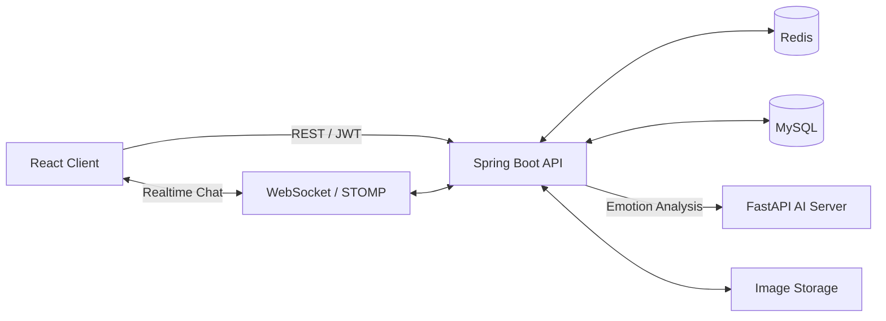

https://github.com/user-attachments/assets/e54702f6-3a04-464d-8702-e6ad51ef7b2d
<div align="center">

# Emour

### Emotion + Amour

**대화 속 감정을 이해하고, 둘만의 순간을 기록하는 커플 메신저**


### 🔗 바로가기

[](https://biainmaze0507-alt.github.io/emour-landing/index.html)
[](https://huggingface.co/chlgks/emour-emotion-kcelectra-context-v2)

> ⚠️ **배포 서버는 2026년 8월 20일 이후 운영이 종료되었습니다.**
> 서비스 동작은 위 **시연 영상**과 **랜딩페이지**에서, 감정 분석 모델은 **Hugging Face**에서 직접 확인하실 수 있습니다.

</div>

---

## 프로젝트 개요

| 항목 | 내용 |
| --- | --- |
| 기간 | 2026.07.06 ~ 2026.08.14 (6주) |
| 유형 | 팀 프로젝트 — 삼성 청년 SW·AI 아카데미(SSAFY) 15기 공통 PJT |
| 인원 | 6명 (Backend 3 · Frontend 2 · AI/Infra 1) |
| 실사용 검증 | 베타 테스트 2일간 **291명**(약 145쌍) 참여 |
| 핵심 성과 | 감정 분석 macro-F1 **0.175 → 0.39** (2.2배) · 분석 지연 **10초 → 약 1초** |

Emour는 연인을 위한 실시간 메신저이자 감정 기록 서비스입니다. 두 사람의 대화를 AI가 분석해 감정 흐름을 보여주고, 오늘의 기분·일정·사진·한 줄 일기를 한 공간에 기록할 수 있습니다.

> 텍스트 대화에는 표정·억양 같은 비언어적 단서가 없습니다. `"그래, 네 마음대로 해"` 한 문장이 불만으로도 평범한 수긍으로도 읽히는 이유입니다.
> **감정을 분석해 시각화하면 이 단서를 보완할 수 있다**는 가설에서 출발했습니다.

---

## ⭐ 본인 담당 범위

6인 팀 프로젝트입니다. **아래는 본인이 담당한 부분이며, 나머지는 팀원들이 맡았습니다.**

| 파트 | 담당 내용 | 근거 |
| --- | --- | --- |
| **AI 감정 분류 모델** | 전 과정 단독 — 라벨 체계 설계 · 데이터 3,648건 구축 · 학습 · 평가 체계 · 추론 서버 · HF 배포 | [🤗 모델](https://huggingface.co/chlgks/emour-emotion-kcelectra-context-v2) · `AI/training/` |
| **인증 (auth)** | 3단계 회원가입(이메일 인증 선행) · JWT Access/Refresh 분리 · Google 소셜 로그인 · SMTP 발송 · 비밀번호 재설정 | `auth/` |
| **회원 (member)** | `app_user` 엔티티 · 상태 관리 · 소프트 탈퇴 · 마이페이지 · 동시성 제어 | `member/` |
| **앨범 (album)** | 커플룸 스코프 · `FileStorage` 저장소 추상화 · 소유권 검증 · `/photos` 4개 엔드포인트 | `album/` |
| **감정분석 실시간화** | 팀원이 구현한 배치 파이프라인을 **idle 타이머 제거 + 폴링마다 즉시 분석**으로 전환 | commit `f40cfd8` |

> 감정분석 파이프라인의 **초기 구현은 팀원**이 맡았고, 본인은 **AI 서버와의 계약(스키마·15라벨)을 고정**하고 **배치 → 실시간 전환**을 담당했습니다.

### 원래 AI 담당이 아니었습니다

**배정된 역할은 백엔드였습니다.** 팀에는 AI 담당이 따로 있었고 그 팀원이 감정분석 모델을 만들고 있었는데, **모델이 서비스에 쓸 수 있는 수준으로 나오지 않았습니다.** 감정 분석은 이 서비스의 핵심 기능이라 그것이 없으면 제품이 성립하지 않았습니다.

**마감 약 1주일 전, 백엔드 4개 도메인을 마친 뒤 제가 하겠다고 나섰습니다.**

당시 **모델 학습·파인튜닝 경험이 없었습니다.** 그때까지 다룬 것은 Vision(YOLOv8)과 음성(SVC)이었고, 텍스트 분류 모델을 직접 학습해본 적이 없었습니다.

> 결과적으로 **1주일 안에 모델을 4차까지 반복**하고, 테스트 서버를 배포해 **291명의 실사용 검증**까지 마쳤습니다.

---

## 🧠 AI 감정 분석 (핵심)

단순히 한 문장만 보는 게 아니라, **직전 대화 맥락까지 함께 이해**해 `"됐어"`·`"괜찮아"`처럼 상황에 따라 의미가 달라지는 말도 제대로 읽어냅니다.

🤗 공개 모델 — **[chlgks/emour-emotion-kcelectra-context-v2](https://huggingface.co/chlgks/emour-emotion-kcelectra-context-v2)**
(문장 단위 초기 모델 [`emour-emotion-kcelectra`](https://huggingface.co/chlgks/emour-emotion-kcelectra) → 맥락 모델 [`-context`](https://huggingface.co/chlgks/emour-emotion-kcelectra-context) → 실사용 로그 재학습 **`-context-v2`** 순으로 공개돼 있습니다)

### 감정 라벨 체계 (15종)

일반적인 감정 분류에 **'관계 신호' 축을 추가로 설계**했습니다. 커플 대화에서는 감정의 긍부정보다 *상대에게 무엇을 전하려는 발화인지*가 더 중요한 경우가 많다고 판단했습니다.

| 분류 | 라벨 |
| --- | --- |
| 긍정 | 기쁨 `JOY` · 설렘 `EXCITEMENT` · 편안 `COMFORT` |
| 중립 | 걱정 `WORRY` · 놀람 `SURPRISE` · 평범 `NEUTRAL` · 부끄러움 `SHYNESS` · 궁금 `CURIOSITY` |
| 부정 | 슬픔 `SADNESS` · 화남 `ANGER` · 당황 `EMBARRASSMENT` · 힘듦 `DISTRESS` |
| **관계 신호** | 고마움 `GRATITUDE` · 미안함 `APOLOGY` · 서운함 `HURT` |

### 1주일 동안의 4차 반복

| 차수 | 학습 데이터 | 결과 |
| --- | --- | --- |
| **1차** | AI Hub 감성대화 말뭉치를 15라벨로 변환 + 합성 보강 | gold셋 macro-F1 **0.73** / 실제 대화 흐름 **0.175** |
| **2차** | 팀원들과 **15감정 롤플레잉 대화를 직접 구축**, 한 줄씩 라벨링 + AI 증강 | 성능 상승, 그러나 **맥락을 못 잡음** |
| **3차** | 라벨링 방식 전환 — **앞 10개 발화 + 마지막 1줄** 단위 | macro-F1 **0.39** (1차 대비 2.2배) |
| **4차** | 테스트 서버 배포 → **291명 실사용** → 유저 대화 로그를 팀원들과 재라벨링 | 최종 모델 → HuggingFace 업로드 |

### 1. 문제 — 잘 나온 지표가 실사용에서 무너졌다

AI Hub 감성대화 말뭉치를 15종 라벨로 변환해 KcELECTRA를 파인튜닝했고, 커플 문장 gold셋(153문장)에서 **macro-F1 0.73**을 기록했습니다. 이 수치로 배포했습니다.

그러나 **실제 대화 흐름에 적용하자 macro-F1이 0.175로 급락**했습니다.

여기서 두 가지를 동시에 확인했습니다.

1. 문장 단위 모델이라 맥락을 읽지 못합니다.
2. **0.73이라는 숫자 자체가 실제 사용 환경을 전혀 반영하지 못한 지표였습니다.**

두 번째가 더 중요한 문제였습니다. **모델을 고치기 전에 평가 방식을 고쳐야 했습니다.**

### 2. 원인 — 모델이 아니라 라벨링 단위였다

기존에는 대화를 **한 줄씩** 보고 감정을 라벨링했습니다. 그러나 실제 대화에서 감정은 앞선 흐름에 의해 결정됩니다.

→ **직전 5~10개 발화를 묶어 맥락을 파악한 뒤 대상 문장의 감정을 판단**하는 방식으로 전환했습니다. 같은 문장이라도 흐름에 따라 감정이 달라진다는 사실을 **모델 구조가 아니라 라벨 단계부터** 반영한 것이 핵심 전환점이었습니다.

### 3. 해결

**입력 재설계** — `[CLS] 맥락 [SEP] 대상 [SEP]` 문장쌍 구조로 직전 대화를 함께 인코딩. 학습 · 추론 · 백엔드 전송 형식을 완전히 일치시켜 서빙 시 불일치를 제거했습니다.

**데이터 직접 구축 — 총 3,648건**

| 종류 | 개수 | 설명 |
| --- | --- | --- |
| 실데이터 | 2,640 | 사람이 직접 라벨링한 실제 대화 |
| ㄴ 실유저 (배포 DB) | 2,193 | 베타테스트 실사용자 291명의 실제 대화 → **3인 교차 라벨링** |
| ㄴ 롤플레이 | 447 | 초기 팀 롤플레이 (1주일·2년차·싸움·놀람당황) |
| 합성 | 858 | 생성 후 사람이 검수 |
| 대조쌍 | 150 | 맥락 학습용 (같은 문장 · 다른 맥락) |
| **합계** | **3,648** | |

- **롤플레이** — 카카오톡 export 변환 파이프라인 개발 (2가지 export 형식, BOM/cp949 인코딩, 발화자 A/B 매핑)
- **대조쌍(contrastive)** — 같은 문장이 맥락에 따라 다른 감정을 갖는 쌍. 모델은 문장만으로 두 샘플을 구분할 수 없으므로 **맥락을 봐야만 손실이 줄어듭니다** → 키워드 암기(shortcut) 방지

**학습** — KcELECTRA warm-start로 기존 감정 지식 재활용, 클래스 불균형 가중 손실, macro-F1 기준 best epoch 선택.

**평가 체계 재설계** — test/valid는 실데이터만 사용하고 합성·대조쌍은 학습 전용으로 분리했습니다. 비교 기준은 우리 데이터를 학습하지 않은 배포 모델로 고정해 **데이터 누수를 0으로** 만들었습니다.

> 새 모델이 기존 모델보다 나은지 비교하는 과정에서 **평가셋 오염으로 점수가 뒤집히는 현상**을 발견해 잡은 것입니다. 내 결과가 좋게 나올 때가 가장 위험합니다.

**추론 전처리** — `기분나빠`(붙여 쓴 표기)가 오분류되는 것을 발견했습니다. 원인은 subword 토크나이저로, 띄어 쓴 `기분 나빠`와 토큰 분해가 달라집니다.
먼저 **데이터 증강**을 시도했으나 학습에 포함하지 않은 다른 붙여쓰기 표기는 여전히 잡지 못했습니다 — 증강은 본 것만 커버합니다. **추론 전 띄어쓰기 교정(kiwipiepy)** 으로 모든 입력을 정규화해, **재학습 없이 서버 코드 변경만으로** 해결했습니다.

### 4. 결과 (동일 실데이터 test)

| 지표 | 배포 단문모델 | 신규 맥락모델 |
| --- | --- | --- |
| 전체 macro-F1 | 0.175 | **0.39 (+0.21, 2.2배)** |
| 당황 | 0.00 | **0.50** |
| 슬픔 | 0.00 | **0.40** |
| 놀람 | 0.00 | **0.22** |

기존에 아예 못 잡던 감정이 복구되고, 같은 문장이 맥락에 따라 다르게 예측되는 것을 확인했습니다.

> 15종 다중분류에서 랜덤 추측의 macro-F1은 약 0.067 수준입니다.
> 절대 수치보다, **누수 없는 평가 기준 위에서 측정한 개선폭**에 의미를 두었습니다.

### 모델을 인프라에 두지 않은 판단

학습한 모델을 서버 인프라에 직접 올리는 대신, **HuggingFace Hub에 올리고 서버가 기동 시 받아 쓰는 구조**를 택했습니다.

| 인프라에 모델 직접 배치 | HuggingFace에서 받아 쓰기 (채택) |
| --- | --- |
| 모델을 바꿀 때마다 배포 파이프라인을 거쳐야 함 | `.env`의 모델 경로만 바꾸고 재시작 |
| 서버 이미지가 모델 크기만큼 무거워짐 | 서버 이미지는 코드만 |
| 롤백 시 이전 이미지가 필요 | 이전 모델 경로로 되돌리면 끝 |
| 모델과 코드의 생애주기가 묶임 | **분리됨** |

1주일 안에 모델을 4차까지 갈아끼워야 했으므로 **교체 비용을 낮추는 것이 가장 중요한 요구**였습니다. 이 판단 덕에 베타 테스트 중 모델 교체가 안전한 작업이 됐습니다.

### 모델 사용해보기

```python
from transformers import pipeline

clf = pipeline(
    "text-classification",
    model="chlgks/emour-emotion-kcelectra-context-v2",
)

# 맥락 + 대상 문장을 함께 입력합니다.
print(clf("오늘 약속 취소됐어 [SEP] 됐어"))
```

### 배운 것

AI 서비스의 성능은 배포 시점이 아니라, **운영에서 얻은 데이터를 다시 학습에 반영하는 과정**에서 완성됩니다.

> **공개 데이터 → 직접 만든 데이터 → 실사용 데이터** 순으로 옮겨간 것이 이 프로젝트의 흐름입니다.
> 각 단계에서 성능이 올라갔고, 그 이유는 매번 **학습 데이터의 분포가 실제 사용 환경에 가까워졌기** 때문입니다.

---

## ⚡ 백엔드 담당 구현

### 감정 분석이 최대 10초 늦게 나왔습니다

초기 구현은 **"10개 누적 또는 10초 idle"** 배치였습니다. 메시지를 모아 한 번에 분석하면 AI 서버 호출 횟수를 줄일 수 있습니다.

그런데 대화가 뜸하면 10개가 안 모이고, idle 타이머가 만료될 때까지 최대 10초를 기다려야 했습니다. 실제로 베타 테스트에서 **"감정분석이 느리다"** 는 피드백을 받았습니다.

전환 전에 다른 방식도 함께 **측정해 비교**했습니다.

| 방식 | 판단 |
| --- | --- |
| 타이머 배치 (초기) | 대화가 뜸할 때 최대 10초 지연 → 폐기 |
| 앙상블 (단문 + 맥락) | 측정 후 비교 → 이득 대비 비용 부족 |
| 라우팅 (조건부 모델 선택) | 측정 후 비교 → 복잡도 증가 |
| **맥락 단독 + 즉시 분석** | **채택** |

idle 타이머를 제거하고 **폴링마다 즉시 분석 + 슬라이딩 윈도우 맥락** 방식으로 전환해 **지연을 10초 → 약 1초로 단축**했습니다. 베타 테스트 피드백이 직접 반영된 개선입니다. *(commit `f40cfd8`)*

**AI 계약 고정** — 스키마와 15라벨을 고정해 모델 교체를 환경변수 수정 + 재시작으로 처리했습니다. 맥락 모델을 배포할 때 **백엔드 코드 변경이 필요 없었고, 무중단 롤백이 가능**했습니다.

### 인증 (auth)

- 이메일 인증을 **선행**하는 3단계 회원가입 — 인증이 완료된 뒤에만 회원 레코드를 생성합니다
- JWT Access/Refresh 분리 발급, **Refresh만 Redis에 TTL로 저장** — 토큰 회수 수단을 확보하기 위한 선택입니다
- Google 소셜 로그인 (ID 토큰 검증 방식), SMTP 실제 발송, 비밀번호 재설정
- 계정 열거(account enumeration) 방지

`POST /auth/signup` · `login` · `login/google` · `refresh` · `logout` · `email/send` · `email/verify` · `password/email` · `password/verify` / `PATCH /auth/password` / `GET /auth/email-check`

### 회원 (member)

`app_user` 엔티티 설계, 상태 관리(`ACTIVE`/`INACTIVE`/`WITHDRAWN`), 소프트 탈퇴, 마이페이지, 동시성 제어(`PESSIMISTIC_WRITE` 락).
`/users/**` — 프로필 조회 · 부분수정 · 비밀번호 변경 · 탈퇴 · 프로필 이미지 (전부 JWT 필수)

### 앨범 (album)

커플룸 단위 스코프, 소유권 검증, `/photos` 업로드 · 조회 · 삭제 · 메모 4개 엔드포인트.

저장소는 **`FileStorage` 인터페이스로 추상화**하고 DB에는 전체 URL이 아니라 **key만 저장**했습니다. 로컬 디렉터리를 기본으로 쓰되 배포 환경의 저장 경로로 교체할 수 있습니다.

---

## 핵심 기능 (서비스 전체)

| 영역 | 제공 기능 |
| --- | --- |
| 회원 | 이메일 회원가입·로그인, JWT 인증, 이메일 인증, 비밀번호 재설정, Google 로그인 |
| 커플 | 초대 코드 생성, 커플 연결·해제·재연결, 사귄 날짜 관리 |
| 채팅 | WebSocket 실시간 채팅, Redis 서버 간 전달, 무한 스크롤, 검색 위치 이동, 읽음 처리 |
| 메시지 | 다중 이미지, 공감, 북마크, 저장 메시지 조회, AI 답장 추천 |
| 감정 분석 | 대화를 묶어서 AI 서버에 분석 요청하고 메시지별 감정 결과 저장 |
| 대시보드 | 감정 흐름, 주요 감정, 자주 쓰는 단어, 대화 흐름, 사진·공감 정량 기록 |
| 기록 | 오늘의 기분, 일정, 기념일, 한 줄 일기, 커플 앨범 |
| 홈 | 배경 이미지, 문구, 위치·크기·정렬·색상·투명도 설정 |

---

## 서비스 구조



- MySQL은 회원, 커플방, 채팅과 분석 결과를 영구 저장합니다.
- Redis는 여러 백엔드 인스턴스 사이에서 실시간 채팅 이벤트를 전달하고, Refresh 토큰·인증 코드를 TTL로 관리합니다.
- AI 서버는 아직 분석하지 않은 메시지와 **직전 문맥(최대 10개)** 을 받아 메시지별 감정을 반환합니다.
- 이미지 저장소는 `FileStorage` 인터페이스 뒤에 있어 배포 환경에 맞게 교체할 수 있습니다.

### 감정 분석 요청 흐름

1. 사용자가 메시지를 전송하면 Spring Boot가 MySQL에 저장합니다.
2. 미분석 메시지를 **직전 대화 맥락과 함께** FastAPI AI 서버로 분석 요청합니다. *(발신자를 A/B로 매핑해 AI 학습 형식과 일치시킵니다)*
3. AI 서버는 문장쌍 형태로 인코딩해 메시지별 감정을 반환합니다.
4. 결과를 MySQL에 저장하고 WebSocket으로 푸시한 뒤, 대시보드에서 감정 흐름으로 시각화합니다.

#### AI 서버 계약

```jsonc
// POST /analyze
{
  "context": [{"speaker": "A", "text": "오늘 약속 취소됐어"}],   // 최대 10개, 읽기전용
  "target":  [{"message_id": 101, "speaker": "B", "text": "됐어"}]
}
// → 응답 개수는 항상 target 개수와 일치
{"101": {"emotion": "서운함"}}
```

---

## 기술 스택

| 구분 | 기술 |
| --- | --- |
| Frontend | React, Vite, React Router, STOMP, SockJS |
| Backend | Java 17, Spring Boot, Spring Security, Spring Data JPA, WebSocket |
| Data | MySQL, Redis |
| AI | Python, FastAPI, KcELECTRA, Hugging Face, PyTorch, kiwipiepy |
| Auth | JWT, BCrypt, Google OAuth 2.0 |
| API 문서 | Springdoc OpenAPI, Swagger UI |
| Infra | Docker Compose, GitLab CI/CD |

### 저장소 구조

```text
Emour
├── AI          FastAPI 추론 서버 (app/) + 학습·평가 스크립트 (training/)
├── backend     Spring Boot — auth · member · album · chat · couple · dashboard · home · mood
├── frontend    React SPA
├── DOCS        API 명세서 · ERD · 요구사항 명세서 · SQL 스키마
└── exec        포팅 매뉴얼 · 시연 시나리오
```
