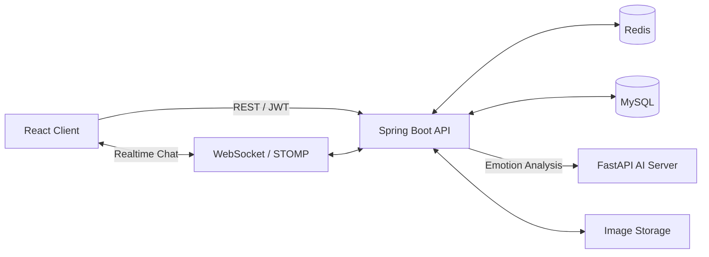

https://github.com/user-attachments/assets/e54702f6-3a04-464d-8702-e6ad51ef7b2d

# Emour

### Emotion + Amour

**대화 속 감정을 이해하고, 둘만의 순간을 기록하는 커플 메신저**

### 🔗 바로가기

> ⚠️ **배포 서버는 2026년 8월 20일 이후 운영이 종료되었습니다.**
> 현재는 서비스 접속이 제한될 수 있습니다.

---
## Emour는 어떤 서비스인가요?

Emour는 연인을 위한 실시간 메신저이자 감정 기록 서비스입니다. 
두 사람의 대화를 AI가 분석하여 감정 흐름을 보여주고, 오늘의 기분·일정·사진·한 줄 일기를 한 공간에 기록할 수 있습니다.

> 대화를 저장하는 데서 끝나지 않고, 서로의 마음을 조금 더 쉽게 이해하도록 돕는 것이 Emour의 목표입니다.

## 핵심 기능

| 영역 | 제공 기능 |
| --- | --- |
| 회원 | 이메일 회원가입·로그인, JWT 인증, 이메일 인증, 비밀번호 재설정, Google 로그인 |
| 커플 | 초대 코드 생성, 커플 연결·해제·재연결, 사귄 날짜 관리 |
| 채팅 | WebSocket 실시간 채팅, Redis 서버 간 전달, 무한 스크롤, 검색 위치 이동, 읽음 처리 |
| 메시지 | 다중 이미지, 공감, 북마크, 저장 메시지 조회, AI 답장 추천 |
| 감정 분석 | 대화를 묶어서 AI 서버에 분석 요청하고 메시지별 감정 결과 저장 |
| 대시보드 | 감정 흐름, 주요 감정, 자주 쓰는 단어, 대화 흐름, 사진·공감 정량 기록 |
| 기록 | 오늘의 기분, 일정, 기념일, 한 줄 일기, 커플 앨범 |
| 홈 | 배경 이미지, 문구, 위치·크기·정렬·색상·투명도 설정 |

## 🧠 AI 감정 분석 (핵심 차별점)

단순히 한 문장만 보는 게 아니라, **직전 대화 맥락까지 함께 이해**해 `"됐어"`·`"괜찮아"`처럼 상황에 따라 의미가 달라지는 말도 제대로 읽어냅니다.

- 배포된 **단문 분류 모델(KcELECTRA)** 을 **대화 맥락을 인식하는 문장쌍 모델**로 고도화
- 실제 커플 대화 기준 **macro-F1 0.175 → 0.39 (약 2.2배 개선)**, 기존에 못 잡던 감정(놀람·당황·슬픔) 회복
- 직접 데이터 수집·라벨링 + **키워드 암기 방지(대조쌍 데이터)** + **누수 없는 정직한 평가 체계** 설계
- 붙여쓰기(`"기분나빠"`)에 강하도록 추론 단계 **띄어쓰기 교정** 적용
- 🤗 공개 모델: **[chlgks/emour-emotion-kcelectra-context](https://huggingface.co/chlgks/emour-emotion-kcelectra-context)** · 자세한 과정은 상단 **📔 Notion 포트폴리오** 참고

## 서비스 구조

- MySQL은 회원, 커플방, 채팅과 분석 결과를 영구 저장합니다.
- Redis는 여러 백엔드 인스턴스 사이에서 실시간 채팅 이벤트를 전달합니다.
- AI 서버는 아직 분석하지 않은 메시지와 직전 문맥을 받아 메시지별 감정을 반환합니다.
- 이미지 저장소는 로컬 디렉터리를 기본으로 사용하며 배포 환경의 저장 경로로 교체할 수 있습니다.

## 기술 스택

| 구분 | 기술 |
| --- | --- |
| Frontend | React, Vite, React Router, STOMP, SockJS |
| Backend | Java 17, Spring Boot, Spring Security, Spring Data JPA, WebSocket |
| Data | MySQL, Redis |
| AI | Python, FastAPI, KcELECTRA, Hugging Face, PyTorch |
| Auth | JWT, BCrypt, Google OAuth 2.0 |
| API 문서 | Springdoc OpenAPI, Swagger UI |
| Infra | Docker Compose, GitLab CI/CD |
