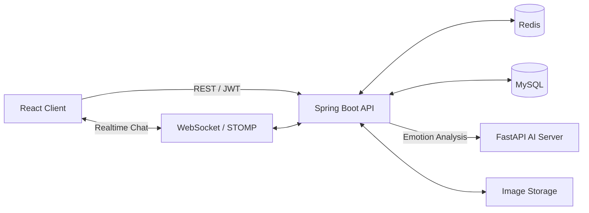

https://github.com/user-attachments/assets/e54702f6-3a04-464d-8702-e6ad51ef7b2d
<div align="center">

# Emour

### Emotion + Amour

**대화 속 감정을 이해하고, 둘만의 순간을 기록하는 커플 메신저**


### 🔗 바로가기

[](https://biainmaze0507-alt.github.io/emour-landing/index.html)
[](https://huggingface.co/chlgks/emour-emotion-kcelectra-context)

> ⚠️ **배포 서버는 2026년 8월 20일 이후 운영이 종료되었습니다.**
> 서비스 동작은 위 **시연 영상**과 **랜딩페이지**에서, 감정 분석 모델은 **Hugging Face**에서 직접 확인하실 수 있습니다.

</div>

---

## 프로젝트 개요

| 항목 | 내용 |
| --- | --- |
| 기간 | 2026.07.06 ~ 2026.08.14 (6주) |
| 인원 | 6명 |
| 담당 역할 | AI 감정 분석 모델 개발 · FastAPI 추론 서버 구축 · Spring Boot 연동 |
| 실사용자 | 베타테스트 291명 |
| 핵심 성과 | 감정 분석 macro-F1 **0.175 → 0.39** (2.2배 개선) |

> 담당 범위: 감정 분류 체계 설계, 데이터 수집·라벨링 파이프라인 구축,
> 모델 학습·평가 체계 설계, FastAPI 추론 서버 구현 및 백엔드 연동

## Emour는 어떤 서비스인가요?

Emour는 연인을 위한 실시간 메신저이자 감정 기록 서비스입니다.<br>
두 사람의 대화를 AI가 분석하여 감정 흐름을 보여주고, 오늘의 기분·일정·사진·한 줄 일기를 한 공간에 기록할 수 있습니다.

> 대화를 저장하는 데서 끝나지 않고, 서로의 마음을 조금 더 쉽게 이해하도록 돕는 것이 Emour의 목표입니다.

## 핵심 기능

| 영역 | 제공 기능 |
| --- | --- |
| 회원 | 이메일 회원가입·로그인, JWT 인증, 이메일 인증, 비밀번호 재설정, Google 로그인 |
| 커플 | 초대 코드 생성, 커플 연결·해제·재연결, 사귄 날짜 관리 |
| 채팅 | WebSocket 실시간 채팅, Redis 서버 간 전달, 무한 스크롤, 검색 위치 이동, 읽음 처리 |
| 메시지 | 다중 이미지, 공감, 북마크, 저장 메시지 조회, AI 답장 추천 |
| 감정 분석 | 대화를 묶어서 AI 서버에 분석 요청하고 메시지별 감정 결과 저장 |
| 대시보드 | 감정 흐름, 주요 감정, 자주 쓰는 단어, 대화 흐름, 사진·공감 정량 기록 |
| 기록 | 오늘의 기분, 일정, 기념일, 한 줄 일기, 커플 앨범 |
| 홈 | 배경 이미지, 문구, 위치·크기·정렬·색상·투명도 설정 |

## 🧠 AI 감정 분석 (핵심 차별점)

단순히 한 문장만 보는 게 아니라, **직전 대화 맥락까지 함께 이해**해 `"됐어"`·`"괜찮아"`처럼 상황에 따라 의미가 달라지는 말도 제대로 읽어냅니다.

🤗 공개 모델: **[chlgks/emour-emotion-kcelectra-context](https://huggingface.co/chlgks/emour-emotion-kcelectra-context)**

### 감정 라벨 체계 (15종)

일반적인 감정 분류에 **‘관계 신호’ 축을 추가로 설계**했습니다.
커플 대화에서는 감정의 긍부정보다 *상대에게 무엇을 전하려는 발화인지*가 더 중요한 경우가 많다고 판단했습니다.

| 분류 | 라벨 |
| --- | --- |
| 긍정 | 기쁨 `JOY` · 설렘 `EXCITEMENT` · 편안 `COMFORT` |
| 중립 | 걱정 `WORRY` · 놀람 `SURPRISE` · 평범 `NEUTRAL` · 부끄러움 `SHYNESS` · 궁금 `CURIOSITY` |
| 부정 | 슬픔 `SADNESS` · 화남 `ANGER` · 당황 `EMBARRASSMENT` · 힘듦 `DISTRESS` |
| 관계 신호 | 고마움 `GRATITUDE` · 미안함 `APOLOGY` · 서운함 `HURT` |

### 1. 문제 — 잘 나온 지표가 실사용에서 무너졌다

AI Hub 감성대화 말뭉치를 15종 라벨로 변환해 KcELECTRA를 파인튜닝했고,
커플 문장 gold셋(153문장)에서 **macro-F1 0.73**을 기록했습니다.

그러나 **실제 대화 흐름에 적용하자 macro-F1이 0.175로 급락**했습니다.
문장 단위 모델이 맥락을 읽지 못한다는 점, 그리고 0.73이라는 숫자가
실사용 환경을 전혀 반영하지 못한 지표였다는 점을 동시에 확인한 지점입니다.

### 2. 원인 — 모델이 아니라 라벨링 단위였다

기존에는 대화를 **한 줄씩** 보고 감정을 라벨링했습니다.
그러나 실제 대화에서 감정은 앞선 흐름에 의해 결정됩니다.

→ **직전 5~10개 발화를 묶어 맥락을 파악한 뒤 대상 문장의 감정을 판단**하는 방식으로 전환했습니다.
같은 문장이라도 흐름에 따라 감정이 달라진다는 사실을 라벨 단계부터 반영한 것이 핵심 전환점이었습니다.

### 3. 해결

**입력 재설계**
`[CLS] 맥락 [SEP] 대상 [SEP]` 문장쌍 구조로 직전 대화를 함께 인코딩.
학습 · 추론 · 백엔드 전송 형식을 완전히 일치시켜 서빙 시 불일치를 제거했습니다.

**데이터 직접 구축 — 총 3,648건**

| 종류 | 개수 | 설명 |
| --- | --- | --- |
| 실데이터 | 2,640 | 사람이 직접 라벨링한 실제 대화 |
| ㄴ 실유저 (배포 DB) | 2,193 | 베타테스트 실사용자 291명의 실제 대화 |
| ㄴ 롤플레이 | 447 | 초기 팀 롤플레이 (1주일·2년차·싸움·놀람당황) |
| 합성 | 858 | 생성 후 사람이 검수 |
| 대조쌍 | 150 | 맥락 학습용 (같은 문장 · 다른 맥락) |
| **합계** | **3,648** | |

- **실유저 데이터**: 배포 DB에서 실제 서비스 대화를 추출 → 3인 교차 라벨링
- **롤플레이**: 카카오톡 export 변환 파이프라인 개발 (2가지 export 형식, BOM/cp949 인코딩, 발화자 A/B 매핑)
- **합성**: 부족한 감정 커버 + 실채팅 톤 생성
- **대조쌍(contrastive)**: 같은 문장이 맥락에 따라 다른 감정을 갖는 쌍 → **키워드 암기(shortcut) 방지**

**학습**
KcELECTRA warm-start로 기존 감정 지식 재활용, 클래스 불균형 가중 손실 적용,
macro-F1 기준 best epoch 선택.

**평가 체계 재설계**
test/valid는 실데이터만 사용하고 합성·대조쌍은 학습 전용으로 분리했습니다.
비교 기준은 우리 데이터를 학습하지 않은 배포 모델로 고정해 **데이터 누수를 0으로** 만들었습니다.

**추론 전처리**
붙여쓰기(`"기분나빠"`)에 강하도록 추론 단계에 띄어쓰기 교정을 적용했습니다.

### 4. 결과 (동일 실데이터 test)

| 지표 | 배포 단문모델 | 신규 맥락모델 |
| --- | --- | --- |
| 전체 macro-F1 | 0.175 | **0.39 (+0.21, 2.2배)** |
| 당황 | 0.00 | **0.50** |
| 슬픔 | 0.00 | **0.40** |
| 놀람 | 0.00 | **0.22** |

기존에 아예 못 잡던 감정이 복구되고, 같은 문장이 맥락에 따라 다르게 예측되는 것을 확인했습니다.

> 15종 다중분류에서 랜덤 추측의 macro-F1은 약 0.067 수준입니다.
> 절대 수치보다, **누수 없는 평가 기준 위에서 측정한 개선폭**에 의미를 두었습니다.

### 배운 것

AI 서비스의 성능은 배포 시점이 아니라, **운영에서 얻은 데이터를 다시 학습에 반영하는 과정**에서 완성됩니다.
잘 나온 지표를 그대로 신뢰하지 않고 실제 사용 조건에서 재측정하는 것이 먼저였습니다.

### 모델 사용해보기

```python
from transformers import pipeline

clf = pipeline(
    "text-classification",
    model="chlgks/emour-emotion-kcelectra-context",
)

# 맥락 + 대상 문장을 함께 입력합니다.
print(clf("오늘 약속 취소됐어 [SEP] 됐어"))
```

## 서비스 구조



- MySQL은 회원, 커플방, 채팅과 분석 결과를 영구 저장합니다.
- Redis는 여러 백엔드 인스턴스 사이에서 실시간 채팅 이벤트를 전달합니다.
- AI 서버는 아직 분석하지 않은 메시지와 직전 문맥을 받아 메시지별 감정을 반환합니다.
- 이미지 저장소는 로컬 디렉터리를 기본으로 사용하며 배포 환경의 저장 경로로 교체할 수 있습니다.

### 감정 분석 요청 흐름

1. 사용자가 메시지를 전송하면 Spring Boot가 MySQL에 저장합니다.
2. 미분석 메시지가 쌓이면 **직전 대화 맥락과 함께** FastAPI AI 서버로 분석을 요청합니다.
3. AI 서버는 문장쌍 형태로 인코딩해 메시지별 감정을 반환합니다.
4. 결과를 MySQL에 저장하고, 대시보드에서 감정 흐름으로 시각화합니다.

## 기술 스택

| 구분 | 기술 |
| --- | --- |
| Frontend | React, Vite, React Router, STOMP, SockJS |
| Backend | Java 17, Spring Boot, Spring Security, Spring Data JPA, WebSocket |
| Data | MySQL, Redis |
| AI | Python, FastAPI, KcELECTRA, Hugging Face, PyTorch |
| Auth | JWT, BCrypt, Google OAuth 2.0 |
| API 문서 | Springdoc OpenAPI, Swagger UI |
| Infra | Docker Compose, GitLab CI/CD |
